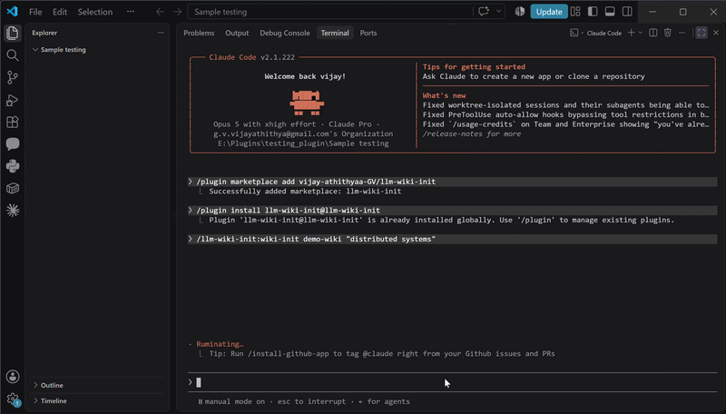

# llm-wiki-init

Scaffold a persistent, self-maintaining markdown knowledge base on any topic —
with one command.



Built on the **LLM Wiki** pattern described by Andrej Karpathy in
[this gist](https://gist.github.com/karpathy/442a6bf555914893e9891c11519de94f).
The pattern is his; this is a Claude Code plugin that sets it up for you.

**Requirements:** Claude Code v2.1.143 or later (check with `claude --version`).
No other dependencies — no Node, no clone, no shell. If you don't see the
`/plugin` command, update Claude Code.

## Plugin vs. command

Two different names, easy to mix up:

| | Name | What it is |
|---|---|---|
| **The plugin** | `llm-wiki-init` | The installable package. You install this once. |
| **The commands** | `/llm-wiki-init:wiki-init`, `/llm-wiki-init:wiki-status` | What you type in Claude Code. Provided by the plugin. |

You install `llm-wiki-init`. You then run `/llm-wiki-init:wiki-init`.

**Commands must include the plugin namespace.** Claude Code registers every
plugin command as `/<plugin-name>:<command-name>`, so the bare `/wiki-init` will
come back as `Unknown command`. The prefix is what keeps plugins from colliding —
any number of installed plugins can ship a command called `wiki-init`, and the
namespace is what tells them apart. Typing `/llm-wiki-init:` in the TUI will
autocomplete the rest.

## Install

```
/plugin marketplace add vijay-athithyaa-GV/llm-wiki-init
/plugin install llm-wiki-init@llm-wiki-init
```

The first line registers this repo as a plugin marketplace. The second installs
the plugin from it.

## Usage

Create a wiki — pass a folder name and whatever topic you want it to cover:

```
/llm-wiki-init:wiki-init my-wiki "topic of your choice"
```

The topic is entirely up to you. Nothing in this plugin assumes a domain.

Then work with it in plain language:

```
ingest this: <paste content, a file path, or a URL>
```

Ask questions normally — answers come back with citations to specific pages.
Ask it to `lint the wiki` for a health check.

Check on an existing wiki at any time:

```
/llm-wiki-init:wiki-status
```

Read-only. Reports page counts per category, the last 5 log entries, and any
orphan pages that aren't linked from the index. It changes nothing.

## Quick example

A full session, start to finish:

```
/llm-wiki-init:wiki-init my-notes "distributed systems"
ingest this: https://example.com/some-article-on-raft
what do I know about leader election?
/llm-wiki-init:wiki-status
```

Lines 1 and 4 are slash commands; lines 2 and 3 are just things you say. That mix
is the point — the plugin scaffolds the folder, and from then on the generated
`CLAUDE.md` is what makes Claude treat it as a wiki.

One caveat: after `/llm-wiki-init:wiki-init` creates `my-notes/`, start your
session **inside** that folder (`cd my-notes` and run `claude`) so its
`CLAUDE.md` loads. Run the ingest from the parent directory and you'll get
generic behavior instead of wiki behavior.

## What you get

`/llm-wiki-init:wiki-init my-wiki "topic of your choice"` produces:

```text
my-wiki/
├── CLAUDE.md          # the schema — rules and workflows for maintaining this wiki
├── README.md          # what this folder is and how to use it
├── raw/               # original sources, never edited
└── wiki/
    ├── concepts/      # ideas, techniques, definitions, themes
    ├── entities/      # people, organizations, products, places, systems
    ├── sources/       # one page per ingested source
    ├── index.md       # catalog of every page, one line each
    ├── log.md         # append-only history of what happened when
    └── overview.md    # evolving big-picture synthesis
```

`CLAUDE.md` is the important one. It's what makes the folder self-maintaining:
any future Claude Code session opened here reads it and knows the rules — raw
sources are immutable, every page gets indexed, contradictions get flagged rather
than quietly overwritten, and gaps get reported instead of filled with guesses.

Re-running `/llm-wiki-init:wiki-init` against a folder that already has a
`CLAUDE.md` is refused. It will never overwrite an existing wiki.

## Why a wiki instead of RAG

RAG re-reads your documents on every question and throws the reasoning away when
it's done — each query starts from zero, and the connections it discovers die
with the response. A wiki does that work once and writes it down, so the tenth
question benefits from everything the first nine established.

The reason this is newly practical is that the expensive part of a knowledge base
was never the reading or the thinking — it was the bookkeeping. Updating twelve
cross-references because one new fact arrived is exactly the kind of tedium a
model will do indefinitely without complaint, and exactly the kind humans abandon
by week three.

## Credit

The LLM Wiki pattern is Andrej Karpathy's:
<https://gist.github.com/karpathy/442a6bf555914893e9891c11519de94f>

This repo packages it as a Claude Code plugin. Read the gist — it explains the
reasoning far better than a README can.

## License

MIT — see [LICENSE](LICENSE).
